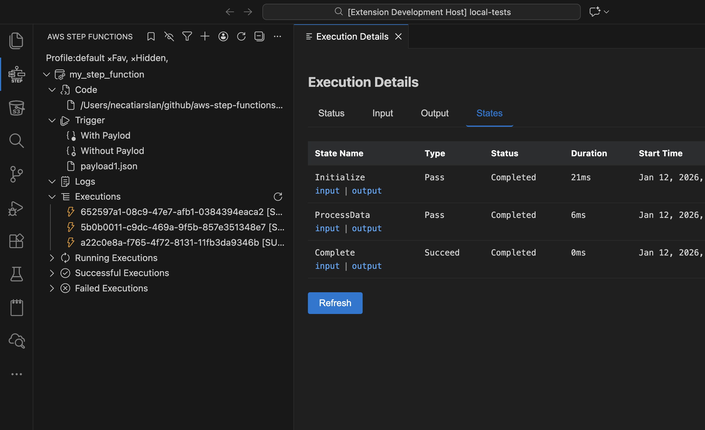

# Aws Step Functions Extension for VSCode

🚀 **AWS Step Functions Extension for VSCode** allows you to interact with your AWS Step Functions directly within VSCode. This extension streamlines the development, testing, and debugging of Step Functions, providing an intuitive interface for triggering functions, viewing logs, and managing payloads—all within your favorite code editor.  

## ✨ Features  

- **Trigger Step Functions**: Run your AWS Step Functions with or without payloads.  
- **Manage Payloads**: Save and reuse JSON payloads for testing.  
- **View CloudWatch Logs**: Instantly access logs related to your Step Functions executions. 
- **Upload Code**: Upload and update your Step Functions with ease.
- **Export Logs**: Save logs for later analysis.  
- **Filter and Search Logs**: Easily navigate through logs using built-in search and filter options.  
- **AWS Profile Support**: Work with multiple AWS profiles seamlessly.  
- **Execution Details View**: Inspect executions in a tabbed view (Status, Input, Output, States)

## Sponsor Me
If you find this extension useful, you can [sponsor me on GitHub](https://github.com/sponsors/necatiarslan).

## Survey
Please take this survey to help me make the extension better.\
TODO: Add Link

## Endpoint Url
You can change your aws endpoint url here. To connect your localstack use the following url: http://localhost:4566

## Aws Credentials Setup
To Access Aws, you need to configure aws credentials. 

For more detail on aws credentials \
https://docs.aws.amazon.com/cli/latest/userguide/cli-configure-files.html \
https://www.youtube.com/watch?v=SON8sY1iOBU

## Bug Report
To report your bugs or request new features, use link below\
https://github.com/necatiarslan/aws-step-functions-vscode-extension/issues/new

## Todo  
- fix graph view
  - https://github.com/aws/aws-toolkit-vscode/tree/master/packages/core/src/stepFunctions/workflowStudio

## Nice To Have
- 

Follow me on linkedin to get latest news \
https://www.linkedin.com/in/necati-arslan/

Thanks, \
Necati ARSLAN \
necatia@gmail.com
